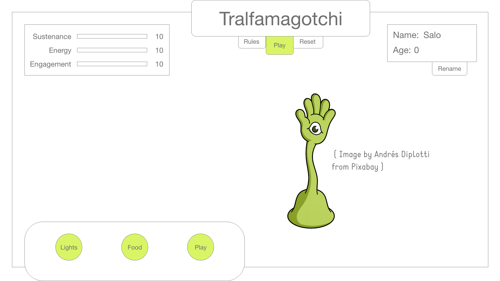
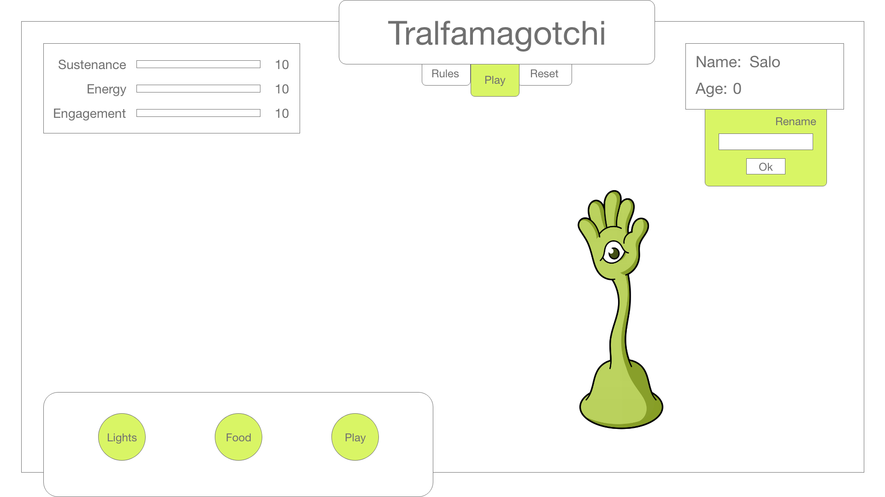
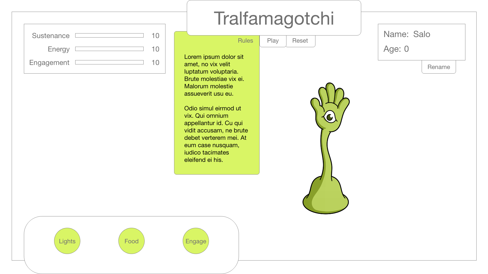

# Tralfamagotchi

A Vonnegut themed Tamagotchi game.

A simple game for any Kurt Vonnegut fans out there. Be a caregiver for a stranded Tralfamadorian! Help them to survive until they grow old enough to repair their broken spaceship, so they may return home to Tralfamadore before they grow too old to make the journey!

- [What is a Tralfamadorian?](https://en.wikipedia.org/wiki/Tralfamadore)

## Index

- [User Stories](#user-stories)
- [Wireframes](#wireframes)
- [Technologies](#technologies)

## User Stories

When the user lands on the page, there will be clearly defined tabs in the top middle of the screen with information on how to start/play the game. 

The 'rules' tab will be easily accessible throughout the game in case a reminder of the gameplay is needed.

Gameplay will involve the user keeping track of the values of sustenance, energy, and engagement (which are set to start at 50 and continually decreasing at steady half second decrements during the game). As a value approaches 0, the user will have to click the corresponding 'care' button that would meet the Tralfamagotchi's needs and raise that value back to 50 at the max. User will have to keep the Tralfamagotchi needs above 0 until the age reaches '3'. The age is on a seperate timer and is incrementing at steady intervals of 1 every 30 seconds.

Behavior of the 'care' buttons: 
- The 'lights' button will switch the game to 'dark mode'. While in dark mode, the Tralfamagotchi's energy will rise at a steady increment of 2 per half second, but the other 2 buttons will be disabled. The Tralfamagotchi won't be able to eat or play while it is sleeping. 

- The 'food' button will feed the Tralfamagotchi and increase its level of sustenance to a max of 50.

- The 'engage' button will increase the level of engagement to a max of 50. 

The 'reset' button will allow the user to reset the game. Once the 'reset' button is clicked, the time will return to 0, and the values of sustenance, energy, and engagement will return to 50.

A 'rename' tab is placed next to the name value for ease in renaming the Tralfamagotchi. The user can choose to rename the Tralfamagotchi as often as they'd like, however gameplay and timers do not pause while the name tab is open. The default name will be 'Salo' if the user does not choose a name.

As soon as sustenance, energy, or engagement reaches 0, a 'GAME OVER' modal window will appear on the screen with a message and the Tralfamagotchi will fade away. User can close the modal and hit 'reset' or refresh the browser to play again.

As soon as age reaches '3', a 'congratulations modal window will appear on the screen with a message. User can close the modal and hit 'reset' or refresh the browser to play again.

## Wireframes

### Landing Page 

A click on the 'play' tab will start the game. Click the 'reset' button to reset the game.

### Landing page with 'rename' tab active

'Rename' tab will slide open when clicked and slide close once 'submit' button is clicked.

### Landing Page with 'rules' tab active

'Rules' tab will slide open once clicked and slide close as mouse leaves.

## Technologies

- HTML
- CSS
- JavaScript
- jQuery

